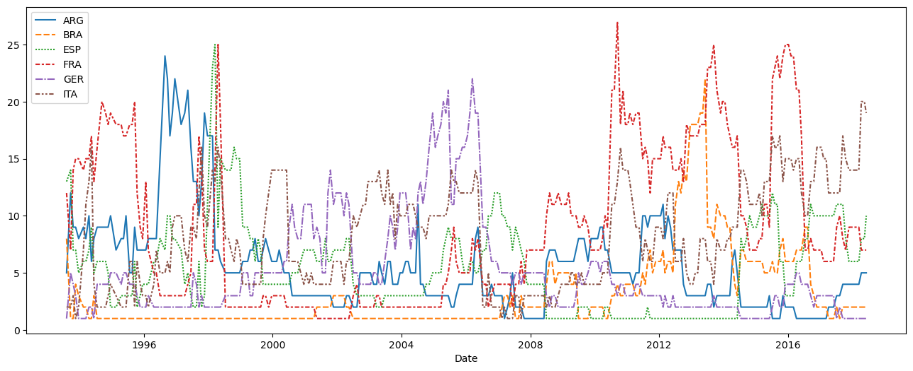
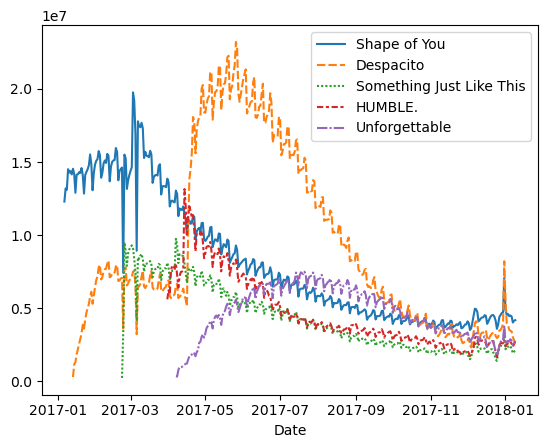
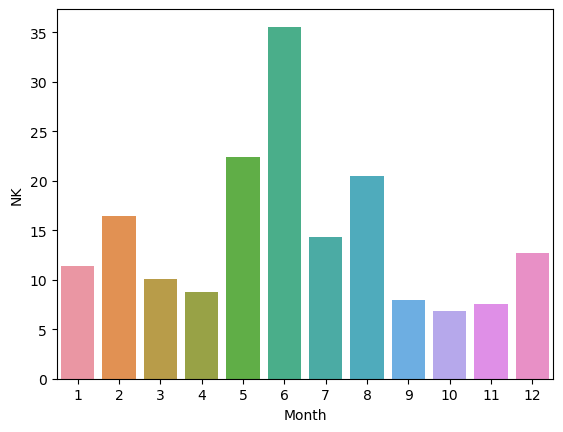
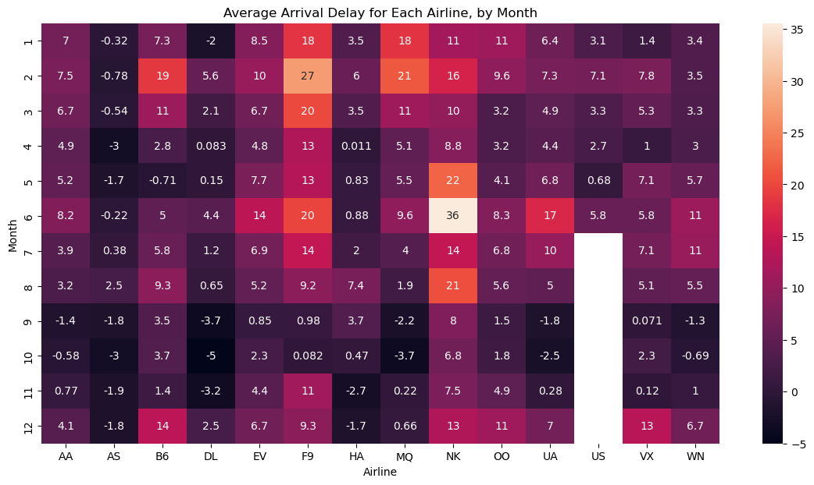
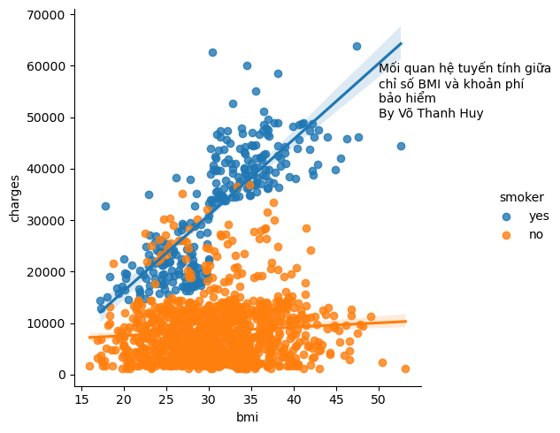
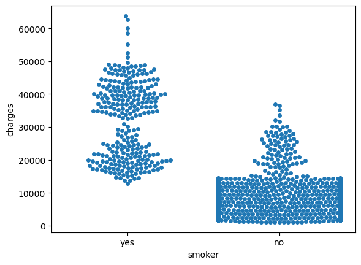

```python
# Bài 1: Hướng dẫn học Data Visualization trên Kaggle
import pandas as pd
pd.plotting.register_matplotlib_converters()
import matplotlib.pyplot as plt
%matplotlib inline
import seaborn as sns
print("Setup Complete")
```

    Setup Complete
    


```python
# Path of the file to read
fifa_filepath = "E:/ml/fifa.csv"

# Read the file into a variable fifa_data
fifa_data = pd.read_csv(fifa_filepath, index_col="Date", parse_dates=True)
```


```python
# Print the first 5 rows of the data
fifa_data.head()
```


<div>
<style scoped>
    .dataframe tbody tr th:only-of-type {
        vertical-align: middle;
    }

    .dataframe tbody tr th {
        vertical-align: top;
    }

    .dataframe thead th {
        text-align: right;
    }
</style>
<table border="1" class="dataframe">
  <thead>
    <tr style="text-align: right;">
      <th></th>
      <th>ARG</th>
      <th>BRA</th>
      <th>ESP</th>
      <th>FRA</th>
      <th>GER</th>
      <th>ITA</th>
    </tr>
    <tr>
      <th>Date</th>
      <th></th>
      <th></th>
      <th></th>
      <th></th>
      <th></th>
      <th></th>
    </tr>
  </thead>
  <tbody>
    <tr>
      <th>1993-08-08</th>
      <td>5.0</td>
      <td>8.0</td>
      <td>13.0</td>
      <td>12.0</td>
      <td>1.0</td>
      <td>2.0</td>
    </tr>
    <tr>
      <th>1993-09-23</th>
      <td>12.0</td>
      <td>1.0</td>
      <td>14.0</td>
      <td>7.0</td>
      <td>5.0</td>
      <td>2.0</td>
    </tr>
    <tr>
      <th>1993-10-22</th>
      <td>9.0</td>
      <td>1.0</td>
      <td>7.0</td>
      <td>14.0</td>
      <td>4.0</td>
      <td>3.0</td>
    </tr>
    <tr>
      <th>1993-11-19</th>
      <td>9.0</td>
      <td>4.0</td>
      <td>7.0</td>
      <td>15.0</td>
      <td>3.0</td>
      <td>1.0</td>
    </tr>
    <tr>
      <th>1993-12-23</th>
      <td>8.0</td>
      <td>3.0</td>
      <td>5.0</td>
      <td>15.0</td>
      <td>1.0</td>
      <td>2.0</td>
    </tr>
  </tbody>
</table>
</div>


```python
# Set the width and height of the figure
plt.figure(figsize=(16,6))

# Line chart showing how FIFA rankings evolved over time 
sns.lineplot(data=fifa_data)
```


    <Axes: xlabel='Date'>


    

    


```python
# Bài 2: Line Charts
# Path of the file to read
spotify_filepath = "E:/ml/spotify.csv"

# Read the file into a variable spotify_data
spotify_data = pd.read_csv(spotify_filepath, index_col="Date", parse_dates=True)
```


```python
# Print the first 5 rows of the data
spotify_data.head()
```


<div>
<style scoped>
    .dataframe tbody tr th:only-of-type {
        vertical-align: middle;
    }

    .dataframe tbody tr th {
        vertical-align: top;
    }

    .dataframe thead th {
        text-align: right;
    }
</style>
<table border="1" class="dataframe">
  <thead>
    <tr style="text-align: right;">
      <th></th>
      <th>Shape of You</th>
      <th>Despacito</th>
      <th>Something Just Like This</th>
      <th>HUMBLE.</th>
      <th>Unforgettable</th>
    </tr>
    <tr>
      <th>Date</th>
      <th></th>
      <th></th>
      <th></th>
      <th></th>
      <th></th>
    </tr>
  </thead>
  <tbody>
    <tr>
      <th>2017-01-06</th>
      <td>12287078</td>
      <td>NaN</td>
      <td>NaN</td>
      <td>NaN</td>
      <td>NaN</td>
    </tr>
    <tr>
      <th>2017-01-07</th>
      <td>13190270</td>
      <td>NaN</td>
      <td>NaN</td>
      <td>NaN</td>
      <td>NaN</td>
    </tr>
    <tr>
      <th>2017-01-08</th>
      <td>13099919</td>
      <td>NaN</td>
      <td>NaN</td>
      <td>NaN</td>
      <td>NaN</td>
    </tr>
    <tr>
      <th>2017-01-09</th>
      <td>14506351</td>
      <td>NaN</td>
      <td>NaN</td>
      <td>NaN</td>
      <td>NaN</td>
    </tr>
    <tr>
      <th>2017-01-10</th>
      <td>14275628</td>
      <td>NaN</td>
      <td>NaN</td>
      <td>NaN</td>
      <td>NaN</td>
    </tr>
  </tbody>
</table>
</div>


```python
# Print the last five rows of the data
spotify_data.tail()
```


<div>
<style scoped>
    .dataframe tbody tr th:only-of-type {
        vertical-align: middle;
    }

    .dataframe tbody tr th {
        vertical-align: top;
    }

    .dataframe thead th {
        text-align: right;
    }
</style>
<table border="1" class="dataframe">
  <thead>
    <tr style="text-align: right;">
      <th></th>
      <th>Shape of You</th>
      <th>Despacito</th>
      <th>Something Just Like This</th>
      <th>HUMBLE.</th>
      <th>Unforgettable</th>
    </tr>
    <tr>
      <th>Date</th>
      <th></th>
      <th></th>
      <th></th>
      <th></th>
      <th></th>
    </tr>
  </thead>
  <tbody>
    <tr>
      <th>2018-01-05</th>
      <td>4492978</td>
      <td>3450315.0</td>
      <td>2408365.0</td>
      <td>2685857.0</td>
      <td>2869783.0</td>
    </tr>
    <tr>
      <th>2018-01-06</th>
      <td>4416476</td>
      <td>3394284.0</td>
      <td>2188035.0</td>
      <td>2559044.0</td>
      <td>2743748.0</td>
    </tr>
    <tr>
      <th>2018-01-07</th>
      <td>4009104</td>
      <td>3020789.0</td>
      <td>1908129.0</td>
      <td>2350985.0</td>
      <td>2441045.0</td>
    </tr>
    <tr>
      <th>2018-01-08</th>
      <td>4135505</td>
      <td>2755266.0</td>
      <td>2023251.0</td>
      <td>2523265.0</td>
      <td>2622693.0</td>
    </tr>
    <tr>
      <th>2018-01-09</th>
      <td>4168506</td>
      <td>2791601.0</td>
      <td>2058016.0</td>
      <td>2727678.0</td>
      <td>2627334.0</td>
    </tr>
  </tbody>
</table>
</div>


```python
# Line chart showing daily global streams of each song 
sns.lineplot(data=spotify_data)
```


    <Axes: xlabel='Date'>


    

    


```python
# Set the width and height of the figure
plt.figure(figsize=(14,6))

# Add title
plt.title("Dòng toàn cầu hàng ngày của các bài hát phổ biến trong 2017-2018")

# Line chart showing daily global streams of each song 
sns.lineplot(data=spotify_data)
```


    <Axes: title={'center': 'Dòng toàn cầu hàng ngày của các bài hát phổ biến trong 2017-2018'}, xlabel='Date'>


    

    


```python
list(spotify_data.columns)
```


    ['Shape of You',
     'Despacito',
     'Something Just Like This',
     'HUMBLE.',
     'Unforgettable']


```python
# Set the width and height of the figure
plt.figure(figsize=(14,6))

# Add title
plt.title("Daily Global Streams of Popular Songs in 2017-2018")

# Line chart showing daily global streams of 'Shape of You'
sns.lineplot(data=spotify_data['Shape of You'], label="Shape of You")

# Line chart showing daily global streams of 'Despacito'
sns.lineplot(data=spotify_data['Despacito'], label="Despacito")

# Add label for horizontal axis
plt.xlabel("Date")
```


    Text(0.5, 0, 'Date')


    

    


```python
# Line chart showing daily global streams of 'Shape of You'
sns.lineplot(data=spotify_data['Shape of You'], label="Shape of You")
```


    <Axes: xlabel='Date', ylabel='Shape of You'>


    

    


```python
# Bài 3 Bar Charts and Heatmaps
# Path of the file to read
flight_filepath = "E:/ml/flight_delays.csv"

# Read the file into a variable flight_data
flight_data = pd.read_csv(flight_filepath, index_col="Month")
```


```python
# Print the data
flight_data
```


<div>
<style scoped>
    .dataframe tbody tr th:only-of-type {
        vertical-align: middle;
    }

    .dataframe tbody tr th {
        vertical-align: top;
    }

    .dataframe thead th {
        text-align: right;
    }
</style>
<table border="1" class="dataframe">
  <thead>
    <tr style="text-align: right;">
      <th></th>
      <th>AA</th>
      <th>AS</th>
      <th>B6</th>
      <th>DL</th>
      <th>EV</th>
      <th>F9</th>
      <th>HA</th>
      <th>MQ</th>
      <th>NK</th>
      <th>OO</th>
      <th>UA</th>
      <th>US</th>
      <th>VX</th>
      <th>WN</th>
    </tr>
    <tr>
      <th>Month</th>
      <th></th>
      <th></th>
      <th></th>
      <th></th>
      <th></th>
      <th></th>
      <th></th>
      <th></th>
      <th></th>
      <th></th>
      <th></th>
      <th></th>
      <th></th>
      <th></th>
    </tr>
  </thead>
  <tbody>
    <tr>
      <th>1</th>
      <td>6.955843</td>
      <td>-0.320888</td>
      <td>7.347281</td>
      <td>-2.043847</td>
      <td>8.537497</td>
      <td>18.357238</td>
      <td>3.512640</td>
      <td>18.164974</td>
      <td>11.398054</td>
      <td>10.889894</td>
      <td>6.352729</td>
      <td>3.107457</td>
      <td>1.420702</td>
      <td>3.389466</td>
    </tr>
    <tr>
      <th>2</th>
      <td>7.530204</td>
      <td>-0.782923</td>
      <td>18.657673</td>
      <td>5.614745</td>
      <td>10.417236</td>
      <td>27.424179</td>
      <td>6.029967</td>
      <td>21.301627</td>
      <td>16.474466</td>
      <td>9.588895</td>
      <td>7.260662</td>
      <td>7.114455</td>
      <td>7.784410</td>
      <td>3.501363</td>
    </tr>
    <tr>
      <th>3</th>
      <td>6.693587</td>
      <td>-0.544731</td>
      <td>10.741317</td>
      <td>2.077965</td>
      <td>6.730101</td>
      <td>20.074855</td>
      <td>3.468383</td>
      <td>11.018418</td>
      <td>10.039118</td>
      <td>3.181693</td>
      <td>4.892212</td>
      <td>3.330787</td>
      <td>5.348207</td>
      <td>3.263341</td>
    </tr>
    <tr>
      <th>4</th>
      <td>4.931778</td>
      <td>-3.009003</td>
      <td>2.780105</td>
      <td>0.083343</td>
      <td>4.821253</td>
      <td>12.640440</td>
      <td>0.011022</td>
      <td>5.131228</td>
      <td>8.766224</td>
      <td>3.223796</td>
      <td>4.376092</td>
      <td>2.660290</td>
      <td>0.995507</td>
      <td>2.996399</td>
    </tr>
    <tr>
      <th>5</th>
      <td>5.173878</td>
      <td>-1.716398</td>
      <td>-0.709019</td>
      <td>0.149333</td>
      <td>7.724290</td>
      <td>13.007554</td>
      <td>0.826426</td>
      <td>5.466790</td>
      <td>22.397347</td>
      <td>4.141162</td>
      <td>6.827695</td>
      <td>0.681605</td>
      <td>7.102021</td>
      <td>5.680777</td>
    </tr>
    <tr>
      <th>6</th>
      <td>8.191017</td>
      <td>-0.220621</td>
      <td>5.047155</td>
      <td>4.419594</td>
      <td>13.952793</td>
      <td>19.712951</td>
      <td>0.882786</td>
      <td>9.639323</td>
      <td>35.561501</td>
      <td>8.338477</td>
      <td>16.932663</td>
      <td>5.766296</td>
      <td>5.779415</td>
      <td>10.743462</td>
    </tr>
    <tr>
      <th>7</th>
      <td>3.870440</td>
      <td>0.377408</td>
      <td>5.841454</td>
      <td>1.204862</td>
      <td>6.926421</td>
      <td>14.464543</td>
      <td>2.001586</td>
      <td>3.980289</td>
      <td>14.352382</td>
      <td>6.790333</td>
      <td>10.262551</td>
      <td>NaN</td>
      <td>7.135773</td>
      <td>10.504942</td>
    </tr>
    <tr>
      <th>8</th>
      <td>3.193907</td>
      <td>2.503899</td>
      <td>9.280950</td>
      <td>0.653114</td>
      <td>5.154422</td>
      <td>9.175737</td>
      <td>7.448029</td>
      <td>1.896565</td>
      <td>20.519018</td>
      <td>5.606689</td>
      <td>5.014041</td>
      <td>NaN</td>
      <td>5.106221</td>
      <td>5.532108</td>
    </tr>
    <tr>
      <th>9</th>
      <td>-1.432732</td>
      <td>-1.813800</td>
      <td>3.539154</td>
      <td>-3.703377</td>
      <td>0.851062</td>
      <td>0.978460</td>
      <td>3.696915</td>
      <td>-2.167268</td>
      <td>8.000101</td>
      <td>1.530896</td>
      <td>-1.794265</td>
      <td>NaN</td>
      <td>0.070998</td>
      <td>-1.336260</td>
    </tr>
    <tr>
      <th>10</th>
      <td>-0.580930</td>
      <td>-2.993617</td>
      <td>3.676787</td>
      <td>-5.011516</td>
      <td>2.303760</td>
      <td>0.082127</td>
      <td>0.467074</td>
      <td>-3.735054</td>
      <td>6.810736</td>
      <td>1.750897</td>
      <td>-2.456542</td>
      <td>NaN</td>
      <td>2.254278</td>
      <td>-0.688851</td>
    </tr>
    <tr>
      <th>11</th>
      <td>0.772630</td>
      <td>-1.916516</td>
      <td>1.418299</td>
      <td>-3.175414</td>
      <td>4.415930</td>
      <td>11.164527</td>
      <td>-2.719894</td>
      <td>0.220061</td>
      <td>7.543881</td>
      <td>4.925548</td>
      <td>0.281064</td>
      <td>NaN</td>
      <td>0.116370</td>
      <td>0.995684</td>
    </tr>
    <tr>
      <th>12</th>
      <td>4.149684</td>
      <td>-1.846681</td>
      <td>13.839290</td>
      <td>2.504595</td>
      <td>6.685176</td>
      <td>9.346221</td>
      <td>-1.706475</td>
      <td>0.662486</td>
      <td>12.733123</td>
      <td>10.947612</td>
      <td>7.012079</td>
      <td>NaN</td>
      <td>13.498720</td>
      <td>6.720893</td>
    </tr>
  </tbody>
</table>
</div>


```python
# Set the width and height of the figure
plt.figure(figsize=(10,6))

# Add title
plt.title("Average Arrival Delay for Spirit Airlines Flights, by Month")

# Bar chart showing average arrival delay for Spirit Airlines flights by month
sns.barplot(x=flight_data.index, y=flight_data['HA'])

# Add label for vertical axis
plt.ylabel("Arrival delay (in minutes)")
```


    Text(0, 0.5, 'Arrival delay (in minutes)')


    

    


```python
# Bar chart showing average arrival delay for Spirit Airlines flights by month
sns.barplot(x=flight_data.index, y=flight_data['NK'])
```


    <Axes: xlabel='Month', ylabel='NK'>


    

    


```python
# Set the width and height of the figure
plt.figure(figsize=(14,7))

# Add title
plt.title("Average Arrival Delay for Each Airline, by Month")

# Heatmap showing average arrival delay for each airline by month
sns.heatmap(data=flight_data, annot=True)

# Add label for horizontal axis
plt.xlabel("Airline")
```


    Text(0.5, 47.7222222222222, 'Airline')


    

    


```python
# Giải thích: Câu lệnh trên sử dụng thư viện Matplotlib và Seaborn trong Python để vẽ một đồ thị heatmap (biểu đồ nhiệt) với dữ liệu về độ trễ chuyến bay trung bình cho mỗi hãng hàng không theo từng tháng.

# Dưới đây là giải thích từng câu lệnh: plt.figure(figsize=(14,7)): Đây là câu lệnh để thiết lập kích thước của hình vẽ. figsize=(14,7) chỉ định kích thước là 14 đơn vị theo chiều rộng và 7 đơn vị theo chiều cao.

#plt.title("Average Arrival Delay for Each Airline, by Month"): Câu lệnh này được sử dụng để đặt tiêu đề cho đồ thị. Trong trường hợp này, tiêu đề được đặt là "Average Arrival Delay for Each Airline, by Month" (Độ trễ đến trung bình cho mỗi hãng hàng không, theo từng tháng).

#sns.heatmap(data=flight_data, annot=True): Đây là câu lệnh để vẽ biểu đồ heatmap. data=flight_data chỉ định dữ liệu đầu vào cho biểu đồ, trong trường hợp này là flight_data. annot=True chỉ định việc hiển thị các giá trị số trên biểu đồ.

#plt.xlabel("Airline"): Câu lệnh này được sử dụng để đặt nhãn cho trục ngang của biểu đồ. Trong trường hợp này, nhãn được đặt là "Airline" (Hãng hàng không).
```


```python
# Bài 4 thực hành vẽ Scatter Plots, file dữ liệu thực hành là insurance
# Path of the file to read
insurance_filepath = "E:/ml/insurance.csv"

# Read the file into a variable insurance_data
insurance_data = pd.read_csv(insurance_filepath)
```


```python
insurance_data.head()
```


<div>
<style scoped>
    .dataframe tbody tr th:only-of-type {
        vertical-align: middle;
    }

    .dataframe tbody tr th {
        vertical-align: top;
    }

    .dataframe thead th {
        text-align: right;
    }
</style>
<table border="1" class="dataframe">
  <thead>
    <tr style="text-align: right;">
      <th></th>
      <th>age</th>
      <th>sex</th>
      <th>bmi</th>
      <th>children</th>
      <th>smoker</th>
      <th>region</th>
      <th>charges</th>
    </tr>
  </thead>
  <tbody>
    <tr>
      <th>0</th>
      <td>19</td>
      <td>female</td>
      <td>27.900</td>
      <td>0</td>
      <td>yes</td>
      <td>southwest</td>
      <td>16884.92400</td>
    </tr>
    <tr>
      <th>1</th>
      <td>18</td>
      <td>male</td>
      <td>33.770</td>
      <td>1</td>
      <td>no</td>
      <td>southeast</td>
      <td>1725.55230</td>
    </tr>
    <tr>
      <th>2</th>
      <td>28</td>
      <td>male</td>
      <td>33.000</td>
      <td>3</td>
      <td>no</td>
      <td>southeast</td>
      <td>4449.46200</td>
    </tr>
    <tr>
      <th>3</th>
      <td>33</td>
      <td>male</td>
      <td>22.705</td>
      <td>0</td>
      <td>no</td>
      <td>northwest</td>
      <td>21984.47061</td>
    </tr>
    <tr>
      <th>4</th>
      <td>32</td>
      <td>male</td>
      <td>28.880</td>
      <td>0</td>
      <td>no</td>
      <td>northwest</td>
      <td>3866.85520</td>
    </tr>
  </tbody>
</table>
</div>


```python
sns.scatterplot(x=insurance_data['bmi'], y=insurance_data['charges'])
```


    <Axes: xlabel='bmi', ylabel='charges'>


    

    


```python
sns.regplot(x=insurance_data['bmi'], y=insurance_data['charges'])
```


    <Axes: xlabel='bmi', ylabel='charges'>


    

    


```python
sns.scatterplot(x=insurance_data['bmi'], y=insurance_data['charges'], hue=insurance_data['smoker'])
# Tổng quan, câu lệnh trên vẽ một biểu đồ scatterplot với trục hoành là chỉ số BMI, trục tung là các khoản phí bảo hiểm, và các điểm được phân loại và tô màu dựa trên thông tin về việc hút thuốc hay không từ cột 'smoker' trong tập dữ liệu insurance_data.
```


    <Axes: xlabel='bmi', ylabel='charges'>


    

    


```python
sns.lmplot(x="bmi", y="charges", hue="smoker", data=insurance_data)
plt.text(50, 50000, 'Mối quan hệ tuyến tính giữa\nchỉ số BMI và khoản phí\nbảo hiểm\nBy Võ Thanh Huy')
# vẽ một biểu đồ lmplot với trục hoành là chỉ số BMI, trục tung là các khoản phí bảo hiểm, và các điểm được phân loại và tô màu dựa trên thông tin về việc hút thuốc hay không từ cột 'smoker' trong tập dữ liệu insurance_data. Biểu đồ lmplot cũng sẽ đi kèm với đường tuyến tính (linear regression line) để xác định mối quan hệ tuyến tính giữa chỉ số BMI và khoản phí bảo hiểm.
```


    Text(50, 50000, 'Mối quan hệ tuyến tính giữa\nchỉ số BMI và khoản phí\nbảo hiểm\nBy Võ Thanh Huy')


    

    


```python
sns.swarmplot(x=insurance_data['smoker'],
              y=insurance_data['charges'])
# vẽ một biểu đồ swarmplot với trục hoành biểu thị thông tin về việc hút thuốc hay không (smoker), và trục tung biểu thị các khoản phí bảo hiểm (charges). Các điểm dữ liệu trên biểu đồ được phân tán và không chồng chéo lên nhau, tạo ra một biểu đồ dạng đám mây (swarm), giúp hiển thị sự phân bố của dữ liệu và tương quan giữa các biến.
```

    C:\Users\Admin\anaconda3\lib\site-packages\seaborn\categorical.py:3544: UserWarning: 37.4% of the points cannot be placed; you may want to decrease the size of the markers or use stripplot.
      warnings.warn(msg, UserWarning)
    


    <Axes: xlabel='smoker', ylabel='charges'>


    C:\Users\Admin\anaconda3\lib\site-packages\seaborn\categorical.py:3544: UserWarning: 60.8% of the points cannot be placed; you may want to decrease the size of the markers or use stripplot.
      warnings.warn(msg, UserWarning)
    


    

    


```python

```
